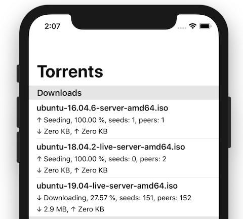

# SwiftyTorrent

Basic torrent client for iOS based on `libtorrent`, built using `SwiftUI` and `Combine`.

List of public domain torrents can be found [here](https://webtorrent.io/free-torrents) (by WebTorrent)

## Requirements

- `Xcode 13.0b4`
- `iOS 15.0`

## Build

    git clone https://github.com/danylokos/SwiftyTorrent
    cd SwiftyTorrent

    # Install Carthage dependencies
    ./carthage.sh bootstrap --platform ios,tvos

    # Install boost and libtorrent
    cd Thirdparties/boost && ./bootstrap.sh
    cd ../..
    cd Thirdparties/libtorrent && ./bootstrap.sh
    cd ../..
    
    open SwiftyTorrent.xcodeproj

Downloads can be found at:

    Files.app -> Locations -> On My iPhone -> SwiftyTorrent -> Downloads

## Features

- opens *.torrent files and magnet links
- integrates with Files app
- restores session between launches

## TODO

- file details screen
- per file prioritization
- ~~pieces prioritization logic for video streaming~~
- ~~option to remove downloaded files when removing torrent~~
- proper event/error handling
- ~~quick look~~
- ~~integrate VLC player for video playback~~
- session status header
- ~~app icon~~

___
[@danylo_kos](https://twitter.com/danylo_kos)
